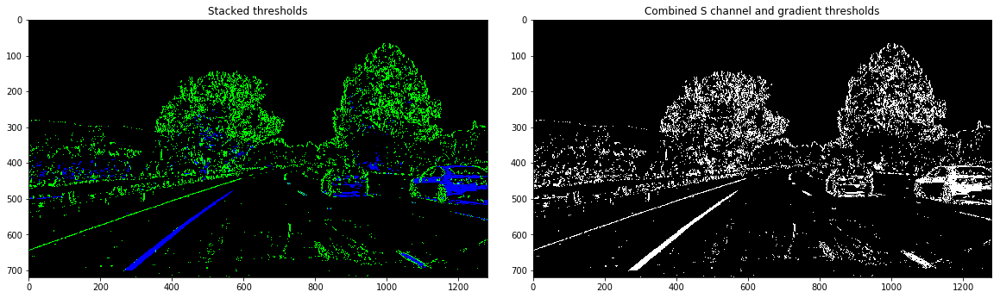

## Advanced Lane Finding
[](http://www.udacity.com/drive)


In this project, your goal is to write a software pipeline to identify the lane boundaries in a video, but the main output or product we want you to create is a detailed writeup of the project.  Check out the [writeup template](https://github.com/udacity/CarND-Advanced-Lane-Lines/blob/master/writeup_template.md) for this project and use it as a starting point for creating your own writeup.  

Creating a great writeup:
---
A great writeup should include the rubric points as well as your description of how you addressed each point.  You should include a detailed description of the code used in each step (with line-number references and code snippets where necessary), and links to other supporting documents or external references.  You should include images in your writeup to demonstrate how your code works with examples.  

All that said, please be concise!  We're not looking for you to write a book here, just a brief description of how you passed each rubric point, and references to the relevant code :). 

You're not required to use markdown for your writeup.  If you use another method please just submit a pdf of your writeup.

The Project
---

The goals / steps of this project are the following:

* Compute the camera calibration matrix and distortion coefficients given a set of chessboard images.
* Apply a distortion correction to raw images.
* Use color transforms, gradients, etc., to create a thresholded binary image.
* Apply a perspective transform to rectify binary image ("birds-eye view").
* Detect lane pixels and fit to find the lane boundary.
* Determine the curvature of the lane and vehicle position with respect to center.
* Warp the detected lane boundaries back onto the original image.
* Output visual display of the lane boundaries and numerical estimation of lane curvature and vehicle position.

The images for camera calibration are stored in the folder called `camera_cal`.  The images in `test_images` are for testing your pipeline on single frames.  If you want to extract more test images from the videos, you can simply use an image writing method like `cv2.imwrite()`, i.e., you can read the video in frame by frame as usual, and for frames you want to save for later you can write to an image file.  

To help the reviewer examine your work, please save examples of the output from each stage of your pipeline in the folder called `output_images`, and include a description in your writeup for the project of what each image shows.    The video called `project_video.mp4` is the video your pipeline should work well on.  

The `challenge_video.mp4` video is an extra (and optional) challenge for you if you want to test your pipeline under somewhat trickier conditions.  The `harder_challenge.mp4` video is another optional challenge and is brutal!

If you're feeling ambitious (again, totally optional though), don't stop there!  We encourage you to go out and take video of your own, calibrate your camera and show us how you would implement this project from scratch!

---

# **Writeup for submission** 

## **Advanced Lane Finding**

Environment used : Docker

Installation guide : [CarND-Term1-Starter-Kit](https://github.com/udacity/CarND-Term1-Starter-Kit/blob/master/doc/configure_via_docker.md)

After installing Docker, clone this repo and in the repo directory run : 

```docker run -it --rm --entrypoint "/run.sh" -p 8888:8888 -v `pwd`:/src udacity/carnd-term1-starter-kit```

Then run `jupyer notebook` with another terminal to launch Jupyter Notebook

Open `P2.ipynb` to run the code for this project

---

### **Apply a distortion correction to raw images**
Load calibration chessboard images, then draw the detected corners with the code below.
```
import glob

# prepare object points, like (0,0,0), (1,0,0), (2,0,0) ....,(6,5,0)
objp = np.zeros((6*9,3), np.float32)
objp[:,:2] = np.mgrid[0:9,0:6].T.reshape(-1,2)

# Arrays to store object points and image points from all the images.
objpoints = [] # 3d points in real world space
imgpoints = [] # 2d points in image plane.

# Make a list of calibration images
images = glob.glob('camera_cal/calibration*.jpg')

fig, axs = plt.subplots(5,4, figsize=(16, 11), squeeze=False)
fig.subplots_adjust(hspace = 0.4, wspace= 0.01)
axs = axs.ravel()

# Step through the list and search for chessboard corners
for i, fname in enumerate(images):
    img = cv2.imread(fname)
    gray = cv2.cvtColor(img, cv2.COLOR_BGR2GRAY)

    # Find the chessboard corners
    ret, corners = cv2.findChessboardCorners(gray, (9,6),None)

    # If found, add object points, image points
    if ret == True:
        objpoints.append(objp)
        imgpoints.append(corners)
    
        # Draw and display the corners
        img = cv2.drawChessboardCorners(img, (9,6), corners, ret)
        axs[i].imshow(img)
    else:
        axs[i].imshow(gray)
        axs[i].text(x = 75, y = 400, s = "No enough corners detected", fontsize=10, backgroundcolor='red')
        print(fname,"doesnt have enough corners detected.")
```
<p align="center">
  
</p>

As shown above, some images can't have all corners detected due to distortion.

Then implement `undistortImage()` with `objpoints` and `imgpoints` from calibration on distorted chessboard image
```
def undistortImage(img, objpoints, imgpoints):
    """
    Takes an image and undistort it with calibration data objpoints and imgpoints
    """
    ret, mtx, dist, rvecs, tvecs = cv2.calibrateCamera(objpoints, imgpoints, img.shape[1:], None, None)
    undistorted = cv2.undistort(img, mtx, dist, None, mtx)
    return undistorted
```
<p align="center">
  
</p>

Now undistort the real image from camera
<p align="center">
  
</p>

---

### **Use color transforms, gradients, etc., to create a thresholded binary image**
Implement `thresholdBinaryImage()` with gradient and color tranformation to calculate binary images.

```
def thresholdBinaryImage(undistorted_image):
    '''
    Threshold the image with gradients and color space transformation
    '''
    # Convert to HLS color space and separate the S channel
    hls_image = cv2.cvtColor(undistorted_image, cv2.COLOR_RGB2HLS)
    s_channel = hls_image[:,:,2]

    # Grayscale image
    gray_image = cv2.cvtColor(undistorted_image, cv2.COLOR_RGB2GRAY)

    # Sobel x
    sobelx = cv2.Sobel(gray_image, cv2.CV_64F, 1, 0) # Take the derivative in x
    abs_sobelx = np.absolute(sobelx) # Absolute x derivative to accentuate lines away from horizontal
    scaled_sobel = np.uint8(255*abs_sobelx/np.max(abs_sobelx))

    # Threshold x gradient
    thresh_min = 20
    thresh_max = 100
    sxbinary = np.zeros_like(scaled_sobel)
    sxbinary[(scaled_sobel >= thresh_min) & (scaled_sobel <= thresh_max)] = 1

    # Threshold color channel
    s_thresh_min = 170
    s_thresh_max = 255
    s_binary = np.zeros_like(s_channel)
    s_binary[(s_channel >= s_thresh_min) & (s_channel <= s_thresh_max)] = 1

    # Stack each channel to view their individual contributions in green and blue respectively
    # This returns a stack of the two binary images, whose components you can see as different colors
    color_binary = np.dstack(( np.zeros_like(sxbinary), sxbinary, s_binary)) * 255

    # Combine the two binary thresholds
    combined_binary = np.zeros_like(sxbinary)
    combined_binary[(s_binary == 1) | (sxbinary == 1)] = 1
    return combined_binary, color_binary
```
<p align="center">
  
</p>

---

### **Apply a perspective transform to rectify binary image ("birds-eye view")**
Now warp the binary image onto bird's-eye view image for line polynomial fitting
```
def warpImage(combined_binary):
    '''
    Warp the combined threshold binary image into bird's-eye view image
    '''
    h, w = combined_binary.shape[:2]
    offset_original = 0.05*w
    offset_warp = (1/4)*w

    # define source and destination points for transform
    src = np.float32([(0.5*w - offset_original, (5/8)*h),
                    (0.5*w + offset_original, (5/8)*h), 
                    (0.1*w,h), 
                    (0.9*w,h)])
    dst = np.float32([(offset_warp,0),
                    (w-offset_warp,0),
                    (offset_warp,h),
                    (w-offset_warp,h)])
    M = cv2.getPerspectiveTransform(src, dst)
    Minv = cv2.getPerspectiveTransform(dst, src)
    warped = cv2.warpPerspective(combined_binary, M, (w,h), flags=cv2.INTER_LINEAR)
    return warped, Minv, src, dst
```
<p align="center">
  
</p>

---

### **Detect lane pixels and fit to find the lane boundary**
Fit the 2nd order polynomials for road lines, and calculte curvatures of lanes and vehicle position with respect to center
in real world space
```
def fitPolynomial(binary_warped):
    '''
    Fits the polynomial and calculates the curvatures of polynomial functions in real world space.
    '''
    # Define conversions in x and y from pixels space to meters
    left_curvature, right_curvature, center_dist = (0, 0, 0)
    ym_per_pix = 30/720 # meters per pixel in y dimension
    xm_per_pix = 3.7/700 # meters per pixel in x dimension

    # Find our lane pixels first
    leftx, lefty, rightx, righty, out_img = findLanePixels(binary_warped, nwindows = 20, margin = 50, minpix = 50)

    # Fit a second order polynomial to each using `np.polyfit`
    left_coeff = np.polyfit(lefty, leftx, 2)
    right_coeff = np.polyfit(righty, rightx, 2)

    y = np.linspace(0, binary_warped.shape[0]-1, binary_warped.shape[0] )
    y_eval = np.max(y)

    if len(leftx) != 0 and len(rightx) != 0:
        # Fit new polynomials to x,y in world space
        left_fit_cr = np.polyfit(lefty*ym_per_pix, leftx*xm_per_pix, 2)
        right_fit_cr = np.polyfit(righty*ym_per_pix, rightx*xm_per_pix, 2)

        # Calculate the new radii of curvature
        left_curvature = ((1 + (2*left_fit_cr[0]*y_eval*ym_per_pix + left_fit_cr[1])**2)**1.5) / np.absolute(2*left_fit_cr[0])
        right_curvature = ((1 + (2*right_fit_cr[0]*y_eval*ym_per_pix + right_fit_cr[1])**2)**1.5) / np.absolute(2*right_fit_cr[0])
        
    # Distance from center is image x midpoint - mean of l_fit and r_fit intercepts 
    if left_coeff is not None and right_coeff is not None:
        h = binary_warped.shape[0]
        car_position = binary_warped.shape[1]/2
        lane_left_position = left_coeff[0]*h**2 + left_coeff[1]*h + left_coeff[2]
        lane_right_position = right_coeff[0]*h**2 + right_coeff[1]*h + right_coeff[2]
        lane_center_position = (lane_left_position + lane_right_position) /2
        center_dist = (car_position - lane_center_position) * xm_per_pix
        
    ## Visualization ##
    # Colors in the left and right lane regions
    out_img[lefty, leftx] = [255, 0, 0]
    out_img[righty, rightx] = [0, 0, 255]

    return out_img, left_coeff, right_coeff, y, left_curvature, right_curvature, center_dist
```
<p align="center">
  
</p>

---

### **Warp the detected lane boundaries back onto the original image**
Lastly unwarp the lines in bird's-eye view back in the real world space
```
def unwarpLanes(original_image, binary_warped, left_coeff, right_coeff, y, Minv):
    '''
    Unwarp the lanes calculated in bird's-eye image back into real world space and draw the lanes
    '''
    if left_coeff is None or right_coeff is None:
        return original_image
    
    # Create an image to draw the lines on
    target_img = np.copy(original_image)
    
    warp_zero = np.zeros_like(binary_warped).astype(np.uint8)
    color_warp = np.dstack((warp_zero, warp_zero, warp_zero))

    left_fitx = left_coeff[0]*y**2 + left_coeff[1]*y + left_coeff[2]
    right_fitx = right_coeff[0]*y**2 + right_coeff[1]*y + right_coeff[2]

    # Recast the x and y points into usable format for cv2.fillPoly()
    pts_left = np.array([np.transpose(np.vstack([left_fitx, y]))])
    pts_right = np.array([np.flipud(np.transpose(np.vstack([right_fitx, y])))])
    pts = np.hstack((pts_left, pts_right))

    # Draw the lane onto the warped blank image
    cv2.fillPoly(color_warp, np.int_([pts]), (0,255, 0))
    cv2.polylines(color_warp, np.int32([pts_left]), isClosed=False, color=(255,0,255), thickness=15)
    cv2.polylines(color_warp, np.int32([pts_right]), isClosed=False, color=(0,255,255), thickness=15)

    # Unwarp color_warp back to original image space using Minv
    unwarped = cv2.warpPerspective(color_warp, Minv, (w, h)) 

    # Combine the result with the original image
    out_img = cv2.addWeighted(target_img, 1, unwarped, 0.6, 0)
    return out_img
```
<p align="center">
  
</p>

---

### **Put everything together**
First test the pipeline on all test images
<p align="center">
  
</p>

Lastly implement the pipeline on the test video

Check the [full video](result_video.mp4)
<p align="center">
  
</p>

---

### **Reflection**
Some issues that might cause pipeline to crash:

1. Using 2nd order polynomial might not be enough for more complicated/curved road
2. Assuming road width as 3.7 meters might not work in other scenes
3. If the ego car deviate from the center too much, assumption in `findLanePixels()` that it has only left and right lines might not work
